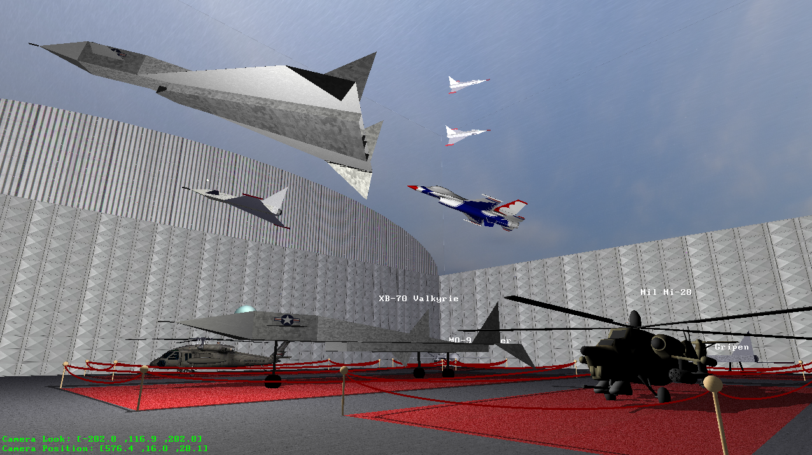

# AirMuseum
Final Project for CSCI 5229 - Computer Graphics @ CU Boulder

Program is always in First Person mode that mimics First Person games.
I am using GLFW for the OpenGL Context and Window manager. 
I restrict movement onto the red carpet areas and from leaving the hangar...

### Bulid & Run:

You need GLFW - a lightweight utility library for use with OpenGL.
Ubuntu:
```
$ sudo apt-get install libglfw3
$ sudo apt-get install libglfw3-dev
```


In the AirMeseum directory I just type:

```
$ cd src
$ make && ./final
```
If any argument is provided (if argc > 1) like :
```
$ ./final something
```
Then program removes the mouse cursor for a more immersive experience!

The executable is called "final"

## Looking around:
You can use the mouse to "look around" as if in a First Person video game.
If no access to mouse, you can also use the arrow keys on keyboard as shown 
below


## Key bindings:
```
  ESC   - Exit
  w       - Move worward
  s       - Move backward
  a       - Strafe left
  d       - Strafe right
  L Arrow - Look left (Camera)
  R Arrow - Look right (Camera)
  U Arrow - Look down (Camera)
  D Arrow - Look down (Camera)
```



